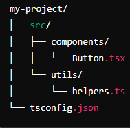

# 사용한 라이브러리
> ## 1. tailwindcss(-D) (npx tailwindcss init -p)
> ## 2. shadcn-ui(-D)
> ## 3. autoprefixer(-D)
> ## 4. postcss(-D)
> ## 5. npx shadcn-ui@latest init

# path 및 모듈 설정

## tsconfig.app.json(ts 컴파일러 설정)
> ``` json 
> {
>   "compilerOptions": {
>     "baseUrl": ".",
>     "paths": {
>       "@/*": ["./src/*"]
>     }
>   }
> } 
> ```
> * tsconfig.app.json 안의 compilerOptions의 설정들.
> * baseUrl 설정은 모듈 해석을 위한 기본 경로를 설정
> * baseUrl을 "." 으로 설정할 경우 import의 경로가 프로젝트의 루트 디렉터리를 기준으로 해석됨 
> 
>
> * ex) 위 사진의 Button.tsx에서 helpers.ts를 import 하려면 "../utils/helpers"로 접근해야 하지만 baseUrl이 "." 으로 설정될 경우 "src/utils/helpers"로 접근 가능
> * paths 설정은 모듈 경로에 대한 별칭을 설정함
> * 저 위의 경우 ./src/를 사용하는 모든 경로의 별칭을 @로 설정

## vite.config.ts(vite 모듈 번들러 설정)
> ``` ts
> export default defineConfig({
>   plugins: [react()],
>   resolve: {
>     alias: {
>       '@': path.resolve(__dirname, "./src"),
>     }
>   }
> })
> ```
> * 위의 resolve의 alias는 모듈 경로의 별칭을 설정함(tsconfig.app.json의 paths 설정과 비슷함. 단, 경로의 별칭을 tsconfig.app.json과 일치시켜야 함)
>
> * js에서 path를 사용하려면 
> ``` js
> const path = require("path");
> ```
>
> * 타입스크립트에서 path를 사용하려면 타입 정의를 포함시켜야 하기 때문에 npm i -D @types/node 후 import문으로 path를 사용해야함